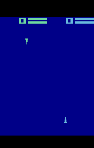

# Agent Vision and Behavior Analysis

## Table of Contents
- [1. Agent Interaction Experiment](#1-agent-interaction-experiment)
- [2. Vision Encoding Analysis](#2-vision-encoding-analysis)
- [3. Vision System Improvement](#3-vision-system-improvement)
- [4. Setup Instructions](#4-setup-instructions)
  - [4.1. Prerequisites](#41-prerequisites)
  - [4.2. Installation](#42-installation)
- [5. Execution Instructions](#5-execution-instructions)
  - [5.1. Training Agents](#51-training-agents)
  - [5.2. Generating Heatmaps](#52-generating-heatmaps)
- [6. Project Structure](#6-project-structure)

---

## 1. Agent Interaction Experiment


In this experiment, we demonstrate:
- One agent is constrained to remain stationary
- The other agent has full mobility and is programmed to eliminate the stationary agent
- This setup helps us understand emergent behaviors in competitive scenarios

## 2. Vision Encoding Analysis


### Key Observations:
- The visualization shows neural activation patterns in the agents' vision encoders
- Brighter regions (white) indicate areas of high importance in the visual field
- Darker regions represent areas of lower significance in the neural processing

### Activation Disparity:
- **Agent 1**: Shows clear, distinct activation patterns, indicating effective visual processing
- **Agent 2**: Displays minimal activation, suggesting impaired or ineffective visual processing
- This disparity highlights a significant performance gap between the two agents

## 3. Vision System Improvement

### Before Optimization


**Initial State Analysis:**
- First agent demonstrates proper visual processing capabilities
- Second agent shows significantly degraded vision performance
- Clear performance gap between agents' visual systems

### After Optimization


**Improvement Process:**
1. Copied successful vision architecture from Agent 1 to Agent 2
2. Conducted targeted policy optimization over multiple epochs
3. Achieved improved visual processing capabilities in Agent 2

## 4. Setup Instructions

### 4.1. Prerequisites

Ensure you have the following installed on your system:

- **Python 3.10 or higher**: [Download Python](https://www.python.org/downloads/)
- **Git**: [Download Git](https://git-scm.com/downloads)
- **CUDA** (optional, for GPU acceleration): [CUDA Toolkit](https://developer.nvidia.com/cuda-downloads)

### 4.2. Installation

1. **Clone the Repository**

   Open your terminal or command prompt and execute:
   ```bash
   git clone https://github.com/chinardankhara/drl-combattank-project.git
   cd https://github.com/chinardankhara/drl-combattank-project.git
   ```

2. **Create a Virtual Environment**

   It's recommended to use a virtual environment to manage dependencies.
   ```bash
   python -m venv venv   
   ```

3. **Activate the Virtual Environment**

   - **Windows:**
     ```bash
     venv\Scripts\activate    
      ```

   - **macOS/Linux:**
     ```bash
     source venv/bin/activate    
      ```

4. **Install Dependencies**

   Install the required Python packages using `pip`:
   ```bash
   pip install --upgrade pip
   pip install -r requirements.txt   
   ```

   *If a `requirements.txt` file is not present, install the following packages manually:*
   ```bash
   pip install torch torchvision torchaudio
   pip install gym
   pip install pettingzoo
   pip install tqdm
   pip install loguru
   pip install matplotlib
   pip install pillow   
   ```

5. **Verify Installation**

   Ensure all packages are installed correctly by running:
   ```bash
   python -c "import torch; print(torch.__version__)"   
   ```

---

## 5. Execution Instructions

### 5.1. Training Agents

The project includes Jupyter notebooks for training different types of agents. Follow the steps below to train each agent.

#### Training a DQN Agent

1. **Navigate to the Project Directory**

   Ensure you're in the root directory of the project.

2. **Launch Jupyter Notebook**
    If using VSCode, install ipykernel extension and use the GUI to open the notebook. For bash, run:
   ```bash
   jupyter notebook train_dqn.ipynb   
   ```

3. **Run Training Cells**

   In the opened notebook, execute each cell sequentially to start training the DQN agent. The notebook includes:
   - Environment setup
   - Agent initialization
   - Training loop with logging and visualization

NOTE: The other agents are trained in a similar manner, with notebooks named appropriately.

### 5.2. Generating Heatmaps

After training agents, you can generate heatmaps to visualize their movement patterns.

1. **Run the Heatmap Generation Script**
   ```bash
   python to_heat_map.py   
   ```

2. **Outputs**

   The script processes GIF episodes and saves heatmaps to the `heatmaps` directory. Each heatmap is titled with the respective training epoch.

---

## 6. Project Structure

```plaintext
.
├── .gitignore
├── README.md
├── requirements.txt
├── train_dqn.ipynb
├── train_sac.ipynb
├── to_heat_map.py
└── src
    ├── agent.py
    ├── agent_ac.py
    ├── agent_dqn.py
    ├── agent_sac.py
    ├── buffer.py
    ├── policy.py
    └── utils.py
```

- **.gitignore**: Specifies files and directories to be ignored by Git.
- **README.md**: Project documentation.
- **requirements.txt**: Lists Python dependencies.
- **train_dqn.ipynb**: Jupyter notebook for training the DQN agent.
- **train_sac.ipynb**: Jupyter notebook for training the SAC agent.
- **to_heat_map.py**: Script to convert agent episodes into heatmaps.
- **src/**: Contains source code modules:
  - **agent.py**: Defines the generic RL agent.
  - **agent_ac.py**: Implements the Actor-Critic agent.
  - **agent_dqn.py**: Implements the DQN agent.
  - **agent_sac.py**: Implements the SAC agent.
  - **buffer.py**: Implements experience replay buffers.
  - **policy.py**: Defines policy networks and related components.
  - **utils.py**: Utility functions and objects.

