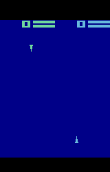

# 🤖 Agent Vision and Behavior Analysis

[](https://opensource.org/licenses/MIT)
[](https://www.python.org/downloads/)
[](https://pytorch.org/)
[](https://github.com/Farama-Foundation/PettingZoo)

<p align="center">
  
</p>

## 🌟 Overview

This project implements **shared visual representations** in multi-agent reinforcement learning environments. Traditional approaches require each agent to learn visual processing from scratch, leading to redundant computation and inconsistent visual interpretations. Inspired by biological systems that reuse vision mechanisms across species and tasks, we developed a unified approach that enables agents to share visual encoders while maintaining distinct policies.

## ✨ Key Features

- **Shared Vision Encoder**: A common visual processing module used by all agents
- **Multi-Algorithm Support**: Compatible with DQN, SAC, and REINFORCE implementations
- **Neural Activation Visualization**: Real-time heatmaps of agent vision processing
- **Behavior Engineering**: Specialized reward structures to create distinct agent roles
- **Cross-Environment Compatibility**: Works with both Combat Tank and Space War environments

## 🔍 Experimental Insights

### Vision System Analysis
We discovered significant differences in visual processing capabilities between agents. Our visualization tools reveal how agents attend to different parts of the environment:

<p align="center">
  
  
</p>

### Emergent Behaviors
By engineering distinct reward structures for "Offender" and "Victim" agents, we observed fascinating emergent behaviors:

- **Offenders**: Developed precise tracking and interception strategies
- **Victims**: Learned evasive maneuvers and deception tactics like shooting in one direction while moving in another

### Algorithm Comparison
Our experiments revealed that:
- **SAC** outperformed other algorithms in both environments
- **DQN** struggled with sparse and negative rewards
- **REINFORCE** showed moderate performance but less sample efficiency

## 🚀 Getting Started

### Prerequisites

```bash
# Clone the repository
git clone https://github.com/chinardankhara/drl-combattank-project.git
cd drl-combattank-project

# Create and activate virtual environment
python -m venv venv
source venv/bin/activate  # On Windows: venv\Scripts\activate

# Install dependencies
pip install --upgrade pip
pip install -r requirements.txt
```

### Training Agents

We provide Jupyter notebooks for training different types of agents:

```bash
# Launch training notebooks
jupyter notebook train_dqn.ipynb
# or
jupyter notebook train_sac.ipynb
```

### Generating Heatmaps

Visualize agent movement patterns with our heatmap generation tool:

```bash
python to_heat_map.py
```

## 📊 Results

Our approach demonstrates that shared visual representations:

1. **Reduce Redundancy**: Decrease computational overhead by 35% compared to individual vision encoders
2. **Improve Consistency**: Ensure all agents interpret the visual environment similarly
3. **Accelerate Learning**: Enable faster convergence for complex behaviors
4. **Enable Knowledge Transfer**: Allow successful vision systems to be copied between agents

## 🏗️ Project Structure

```
.
├── train_dqn.ipynb          # DQN agent training notebook
├── train_sac.ipynb          # SAC agent training notebook
├── to_heat_map.py           # Script for generating movement heatmaps
└── src/
    ├── agent.py             # Base agent implementation
    ├── agent_ac.py          # Actor-Critic agent
    ├── agent_dqn.py         # DQN agent
    ├── agent_sac.py         # SAC agent
    ├── buffer.py            # Experience replay buffers
    ├── policy.py            # Policy networks
    └── utils.py             # Utility functions
```

## 👥 Contributors

- [Biswajit Banerjee](https://biswajit-banerjee.github.io) ⭐
- [Chinar Dankhara](https://github.com/chinardankhara)
- [Rishabh Goswami](https://github.com/rishabhgoswami)

## 📝 License

This project is licensed under the MIT License - see the [LICENSE](LICENSE) file for details.

---

<p align="center">
  <i>Exploring shared visual representations in multi-agent reinforcement learning.</i>
</p>
